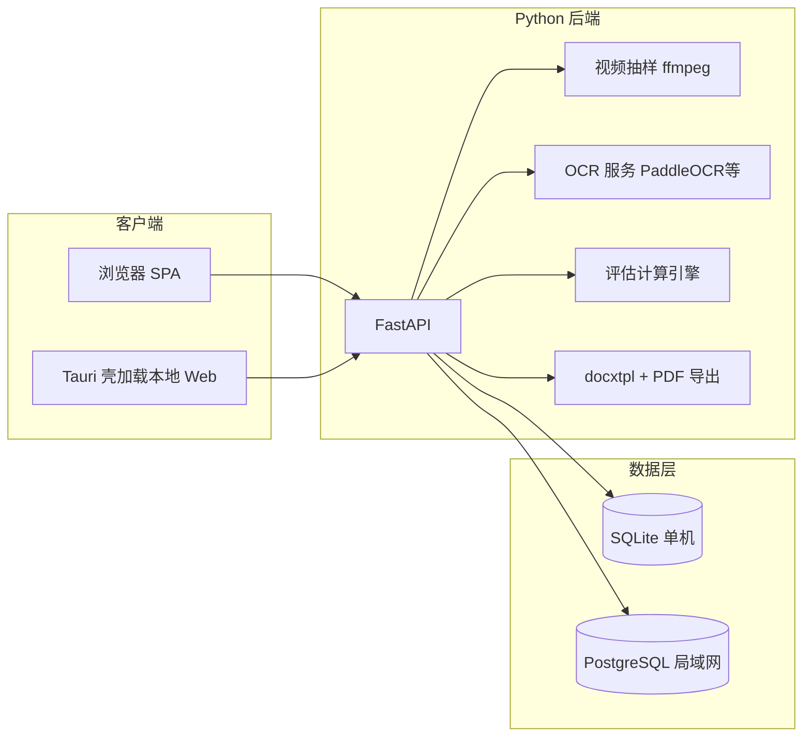

# 排水管道 CCTV 检测报告系统 — 技术实施方案

## 标准与合规要点（DB31/T 444-2022）

- **适用范围**：《排水管道电视和声呐检测评估技术规程》DB31/T 444-2022（2022-12-01 实施，替代 2009 版）适用于市政排水管道及附属设施的电视、声呐检测与评估；实施时以**正式出版物/PDF 全文**为唯一依据。
- **与实现直接相关的部分**（需在开发前从标准正文中**逐条抄写**进配置，禁止凭网络摘要硬编码）：
  - **缺陷分类与代码**：结构性 vs 功能性，缺陷名称、等级、权重或分值表（通常在附录）。
  - **修复指数（RI）与养护指数（MI）**：条文中的 **F / G** 的取法，以及 **K（地区重要性）、E（管道重要性）、T（土质影响）** 等参数的查表规则与默认值。
  - **等级划分**：公开资料中常见表述为 **RI/MI &lt; 4 一级，4～7 二级，≥7 三级**，但最终阈值与档位名称以标准正文为准。
- **实施策略**：将「公式 + 附录表」做成版本化规则包（例如 [`config/standards/db31t444-2022/`](config/standards/db31t444-2022/) 下的 YAML/JSON + CSV），计算引擎只读配置；标准换版时**只更新数据文件**并 bump `rules_version`。若条文与国标 CJJ 181 类同处，仍以 **444 为准**。

> 说明：网络上部分下载链指向**其他标准**（例如误打开成 DB31 SW/Z 类文件）；开发阶段必须在仓库内保存**带标准号的封面页截图或官方采购记录**，避免规则录错。

## 当前仓库与模板资产

- 在 [`d:\code\CCTV-report`](d:\code\CCTV-report) **根目录**已可看到（与 Cursor 侧文件索引不同步时以磁盘为准）：
  - [`公共通道雨水管CCTV委托单.doc`](公共通道雨水管CCTV委托单.doc) — 委托单范本，用于梳理 `projects` 表单字段；
  - [`CC01-2  报告模板.docx`](CC01-2%20%20报告模板.docx) — 报告 docxtpl 母版（实施阶段可拷贝为 [`templates/report/CC01-2-base.docx`](templates/report/CC01-2-base.docx) 并加占位符）；
  - [`公共通道统计表.xlsx`](公共通道统计表.xlsx) — 可选：导出/对账用字段参考；
  - [`视频`](视频) 目录 — 样例或批处理素材占位。
- 待办：从上述 Word 提取**字段清单**，写成 [`templates/commission_fields.md`](templates/commission_fields.md)（或 OpenAPI `Project` schema 注释），并与后端模型一一对齐。

## 前端 UI 与 [animal-island-ui](https://github.com/guokaigdg/animal-island-ui)

- **定位**：采用已选型的 **React + Vite + TypeScript** SPA，整体交互与观感参考 [guokaigdg/animal-island-ui](https://github.com/guokaigdg/animal-island-ui)（圆角卡片、柔和色板、动效节奏、对话框裁切等）。优先阅读其 [`AI_USAGE.md`](https://github.com/guokaigdg/animal-island-ui/blob/main/AI_USAGE.md) 与 [`DESIGN_PROMPT.md`](https://github.com/guokaigdg/animal-island-ui/blob/main/DESIGN_PROMPT.md)（或 `skill/SKILL.md`）以复用 **设计 token**，避免臆造 API。
- **落地方式（推荐）**：以「视觉一致 + 自有实现」为主——在全局 CSS 变量层对齐其色板/圆角/阴影，表单与数据表用 **自建布局**或 Headless 组件拼装，保证与检测业务（长表格、批量导入、状态密集）磨合；必要时再按需引入少量 npm 组件。
- **许可注意**：该仓库 README 中写明**禁止商业使用、企业项目**等限制，与 MIT License 段落并存；若本产品面向检测单位**正式交付/商业场景**，务必请你方**自行确认法律边界**：或取得作者书面许可后 `npm install animal-island-ui`，或**不直接依赖该包**、仅作公开设计参考并实现自有样式（最稳妥）。

## 总体架构（本机 + 可选局域网）

- **统一代码库**：一个 **FastAPI** 服务 + 一个 **React + Vite + TypeScript** 前端 SPA；UI 视觉对齐 **animal-island-ui**（见上一节）。
- **桌面端**：**Tauri 2**（优先，包体小）或 Electron；壳内加载 `http://127.0.0.1:<port>` 或内嵌 `dist`，单机场景下由壳负责**启动/停止**内置后端子进程（或固定安装路径）。
- **部署切换**：通过环境变量选择 `DATABASE_URL`：`sqlite:///...`（本机）或 `postgresql://...`（局域网）；文件存储路径本机用本地目录，服务器用共享盘或对象存储接口（首期可用 NAS 路径挂载）。

## 核心功能模块

### 1. 项目（按工程归档）

- **数据表**：`projects`（委托单字段全集）、`segments`（管段）、`defects`（缺陷记录）、`media`（视频/截图/导出文件元数据）、`audit_log`（可选）。
- **管段主键**：`project_id` + `segment_uid`；保留**原始文件名**、**用户确认后规范化文件名**、`video_path`、`preview_frame_path`。

### 2. 视频导入与管段建档

- **流程**：上传/复制视频 → 用 **ffmpeg** 在随机时间点抽帧（可配置：避开头尾各 N 秒、多次抽样取 OCR 置信度最高）→ 保存 PNG → OCR。
- **OCR**：推荐 **PaddleOCR**（中文鲁棒性好）；引擎与模型路径可配置，便于离线内网。对识别结果用正则匹配 `W1-W2`、`w1-w2`、井号+里程等模式，**必须经人工确认/编辑**后再写库并重命名文件（生成规范名如 `工程编号_W3-W4_原短哈希.mp4`）。

### 3. 缺陷录入与指数计算

- **UI**：缺陷类型、等级、**时钟方位**、**缺陷距离/链距**、备注；可关联视频时间点与截图。
- **计算**：用户选缺陷后，引擎根据 `rules_version` 聚合出 **F/G**，再乘/加查表参数得到 **RI/MI** 及等级（实现完全由配置文件驱动，单元测试覆盖标准中的**算例或条文边界**）。

### 4. 报告导出（Word + PDF）

- **Word**：使用 **python-docx** + **docxtpl**（Jinja2 占位符）在 [`CC01-2` 范本](templates/report/CC01-2-base.docx)上渲染：封面、项目信息表、管段一览、缺陷表、评估结论、附图位。
- **PDF**（按优先级）：
  1. **LibreOffice headless**（`soffice --headless --convert-to pdf`）— 跨平台、可自动化；
  2. Windows 环境可选 **Word COM** 作为后备（需安装 Office，维护成本高）；
  3. 避免直接用 docx→HTML→PDF 造成版式漂移，除非接受与范本不一致。

## 非功能需求（视频与 OCR「大量处理」）

- **任务队列**：本机可用 **FastAPI BackgroundTasks** 起步；视频批处理量大时升级为 **RQ/Celery + Redis**（局域网模式）或本地 **SQLite 队列表 + worker 进程**。
- **存储**：视频大文件不入数据库仅存路径；定期清理临时抽帧目录。
- **性能**：抽帧/OCR 可并行，限制并发防止机械硬盘卡死（可配置 `max_workers`）。

## 安全与权限（局域网模式）

- 简单 **JWT + 角色**（管理员/检测员/只读）即可满足内网首开；单机可默认单用户免登录或本地 PIN。

## 验证与交付

- **单元测试**：计算引擎（给定缺陷列表 → 期望 RI/MI）；文件名解析；OCR 结果正则。
- **契约测试**：报告生成后**版式**由人工对照范本 1～2 份盖章流程走完。
- **安装**：Windows 下提供 **安装包**：内置 Python runtime 或使用 PyInstaller 打后端单体 exe + Tauri 安装程序；附带 **ffmpeg**、**PaddleOCR 模型**离线包说明。

## 风险与依赖

- **标准文本获取**：必须采购/档案室取得 DB31/T 444-2022 正式文本后再固化规则；网络摘要不可作为验收依据。
- **范本复杂度**：若 `CC01-2` 含复杂页眉/域/分节，docxtpl 需细分子文档或保留「固定版式区 + 仅表格循环区」策略。
- **声呐**：若首期只做 CCTV，可在 `project.detection_method` 标记并在报告中隐藏声呐章节。
