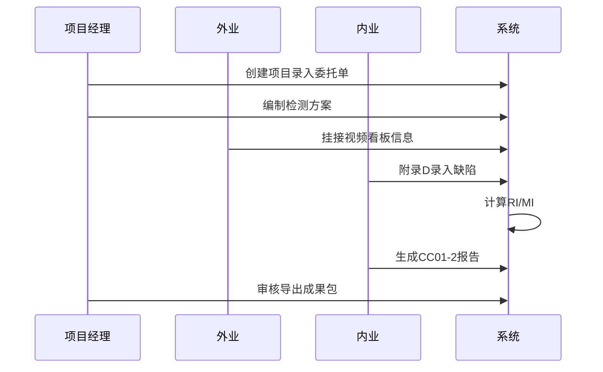
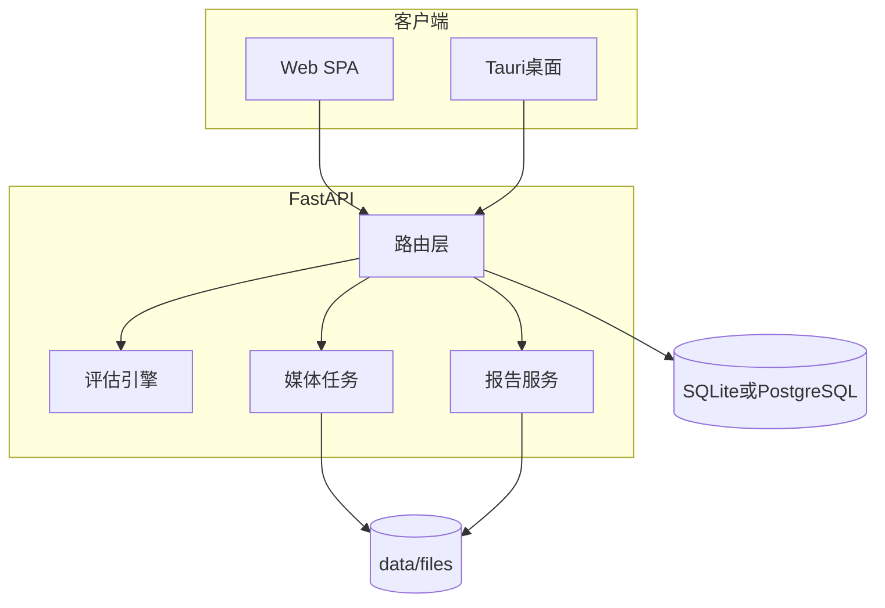

# CCTV 检测项目管理软件 — 软件开发文档（SDD）

| 项 | 内容 |
|----|------|
| 文档版本 | 1.0.0 |
| 标准依据 | DB31/T 444-2022《排水管道电视和声呐检测评估技术规程》 |
| 首期范围 | 管道电视检测 — **结构性 + 功能性** |
| 客户端 | Web SPA + 桌面 GUI（Tauri） |
| 后端 | Python FastAPI |

---

## 合规声明

1. 仓库内 [MinerU 规程 Markdown](../MinerU_markdown_DB31-T_444-2022排水管道电视和声呐检测评估技术规程_2055030793924440064.md) 仅供开发参考，**不能替代**标准正式 PDF。  
2. 评估系数、权重表、等级阈值须在验收前对照 **出版物全文** 校核，并固化 `rules_version`。  
3. 业务模板（`CC01-2  报告模板.docx`、`公共通道雨水管CCTV委托单.doc`、`公共通道统计表.xlsx`）以委托方签字范本为准。

---

## 1. 引言

### 1.1 目的

本文档描述 **CCTV 检测项目管理系统** 的软件需求、架构、数据、接口、界面、部署与测试，供产品、开发、测试与验收使用。实现须满足 DB31/T 444-2022 中 **电视检测** 与 **管道结构/功能评估** 的条文（首期不含声呐、检查井专项流程）。

### 1.2 读者

- 项目经理、检测单位技术负责人  
- 前后端与桌面端开发  
- QA 与标准合规审核  

### 1.3 术语（摘自规程第 3 章）

| 术语 | 说明 |
|------|------|
| 电视检测 CCTV | 远程采集图像，有线/无线传输，记录管道内状况 |
| 管段 | 相邻两检查井之间的管道，为 **最小评估单位**（10.1.2） |
| 结构性缺陷 | 影响管道结构稳定性的缺陷（表 7） |
| 功能性缺陷 | 影响过水能力的功能障碍（表 8） |
| 修复指数 RI | 结构性状况指标（式 4） |
| 养护指数 MI | 功能性状况指标（式 9） |
| 时钟表示法 | 顺时针钟点描述环向缺陷位置（附录 G） |

### 1.4 参考文档

| 文档 | 路径 |
|------|------|
| 产品说明 | [PRODUCT.md](PRODUCT.md) |
| 评估引擎 | [design/evaluation-engine.md](design/evaluation-engine.md) |
| 附录 D 表单 | [design/forms-appendix-d.md](design/forms-appendix-d.md) |
| 领域模型 | [design/domain-model.md](design/domain-model.md) |
| API 提纲 | [api/openapi-outline.md](api/openapi-outline.md) |
| Web UI | [ui/web-ia.md](ui/web-ia.md) |
| 桌面 GUI | [ui/desktop-gui.md](ui/desktop-gui.md) |
| 模板映射 | [templates/report-mapping.md](templates/report-mapping.md) |

---

## 2. 标准符合性矩阵（首期）

| 规程章节 | 内容 | 软件能力 | 状态 |
|----------|------|----------|------|
| 4 | 基本要求、检测方案 | 项目/方案模块 | 首期 |
| 5.3 | 检测方案内容 | DetectionPlan 表单 | 首期 |
| 5.4 / 7.2.3 | 看板 | 管段看板字段 | 首期 |
| 7.1–7.2 | 传统电视检测 | 视频、缺陷、中止 RS/ZZ | 首期 |
| 7.3–7.5 | QV/无人机/数字化电视 | — | **二期** |
| 8 | 声呐 | — | **二期** |
| 9 | 检查井 | — | **二期** |
| 10.1–10.4 | 缺陷与 RI/MI | 评估引擎 | 首期 |
| 10.3.8–10.3.9 | 检查井 M 值 | — | **二期** |
| 11.1–11.5 | 成果资料 | 报告、导出、单位信息 | 首期 |
| 11.6b | GIS 关联 | — | **二期** |
| 附录 C | 缺陷等级样图 | 判读参考链接/图库 | 二期图库 |
| 附录 D | 电视检测记录表 | DefectRecord + 导出 | 首期 |
| 附录 K/L | 等级统计表 | 工程汇总导出 | 首期 |
| 附录 I | K 值路段 | 手工选择 + 名录检索 | 首期/二期增强 |

---

## 3. 用户与场景

### 3.1 角色

见 [PRODUCT.md](PRODUCT.md)。

### 3.2 典型 E2E 场景



---

## 4. 功能需求（首期）

每条 FR 含：**描述**、**规程依据**、**UI**、**API**、**验收标准**。

### FR-01 项目/委托管理

| 项 | 内容 |
|----|------|
| 描述 | 创建、编辑、列表、删除工程；字段对齐委托单与 [report-mapping.md](templates/report-mapping.md) |
| 规程 | 11.3–11.4 |
| UI | `/projects`, `/projects/new` |
| API | `GET/POST/PATCH/DELETE /api/v1/projects` |
| 验收 | 创建后列表可见；字段与委托单一致 |

### FR-02 检测方案

| 项 | 内容 |
|----|------|
| 描述 | 按 5.3 节分节保存 DetectionPlan，支持版本号 |
| 规程 | 5.3 |
| UI | `/projects/:id/plan` |
| API | `GET/PUT .../plan` |
| 验收 | 各节内容持久化并可打印预览 |

### FR-03 管段与看板

| 项 | 内容 |
|----|------|
| 描述 | 管段 CRUD；附录 D 表头；检测方向、长度 L |
| 规程 | 7.2.3–7.2.5, 附录 D |
| UI | 工作台左栏、看板条 |
| API | `/projects/{id}/segments`, `PATCH /segments/{id}` |
| 验收 | 管段 `pipe_length_m` 参与评估分母 |

### FR-04 视频与 OCR 辅助

| 项 | 内容 |
|----|------|
| 描述 | 上传/本地路径；ffmpeg 抽帧；OCR 建议井号；**人工确认** |
| 规程 | 7.2.7–7.2.8 |
| UI | VideoPanel |
| API | `.../video`, `.../extract-preview`, `.../ocr-preview` |
| 验收 | 预览图可显示；OCR 结果可编辑写入井号 |

### FR-05 缺陷录入（附录 D）

| 项 | 内容 |
|----|------|
| 描述 | 表格式录入结构/功能/特殊/操作码；钟点、距离、媒体片段 |
| 规程 | 7.1.5, 附录 D, 表 7–11 |
| UI | DefectGrid |
| API | `/defects`, `/inspection-record` |
| 验收 | 导出 xlsx 列与附录 D 一致 |

### FR-06 评估引擎

| 项 | 内容 |
|----|------|
| 描述 | 按 [evaluation-engine.md](design/evaluation-engine.md) 计算 S/F/Y/G/RI/MI；FZ 不计 MI；1 m 合并 |
| 规程 | 10.1.3, 10.3–10.4 |
| UI | 评估卡片 |
| API | `POST .../evaluate` |
| 验收 | TC-EVAL-01～04 自动化通过 |

### FR-07 工程级统计

| 项 | 内容 |
|----|------|
| 描述 | 附录 K/L；对齐 `公共通道统计表.xlsx` |
| 规程 | 11.5a, 附录 K/L |
| UI | 报告页预览 |
| API | `/summary/structural`, `/export/statistics.xlsx` |
| 验收 | 与手工 Excel 对账一致 |

### FR-08 报告 Word/PDF

| 项 | 内容 |
|----|------|
| 描述 | docxtpl 渲染 CC01-2；LibreOffice PDF |
| 规程 | 11.5 |
| UI | `/projects/:id/reports` |
| API | `/reports/docx`, `/reports/pdf` |
| 验收 | Word 占位符替换正确 |

### FR-09 成果包

| 项 | 内容 |
|----|------|
| 描述 | zip：docx、pdf、xlsx、JSON 记录、媒体清单 |
| 规程 | 11.2 |
| API | `/export/package.zip` |
| 验收 | 解压结构完整 |

### FR-10 审核与审计

| 项 | 内容 |
|----|------|
| 描述 | 报告状态流；缺陷/评估变更日志 |
| 规程 | 11.6a |
| API | `/audit-logs` |
| 验收 | 修改缺陷后日志可查 |

---

## 5. 非功能需求

| ID | 类别 | 要求 |
|----|------|------|
| NFR-01 | 性能 | 单管段评估 < 1 s；列表 100 管段 < 2 s |
| NFR-02 | 可用性 | 工作台三栏；缺陷表键盘可操作 |
| NFR-03 | 可靠性 | SQLite 事务；报告生成失败可重试 |
| NFR-04 | 安全 | 路径校验；JWT；本地 API 仅 127.0.0.1 |
| NFR-05 | 可维护 | 规则包 `rules_version`；算例单测 |
| NFR-06 | 部署 | Windows 优先；可选 PostgreSQL |
| NFR-07 | 备份 | `data_root` 目录可复制迁移 |

---

## 6. 系统架构

见 [PRODUCT.md](PRODUCT.md) 与下图。



### 6.1 技术栈

| 层 | 选型 |
|----|------|
| Web | React 18, TypeScript, Vite |
| 桌面 | Tauri 2 |
| 后端 | FastAPI, SQLAlchemy 2, Alembic |
| DB | SQLite（默认）, PostgreSQL |
| 媒体 | ffmpeg, ffprobe |
| OCR | PaddleOCR（可插拔） |
| 报告 | docxtpl, LibreOffice soffice |

### 6.2 目录结构（建议）

```text
backend/app/          # API, models, services
frontend/src/         # SPA
frontend/src-tauri/   # 桌面壳
config/standards/     # db31t444-2022 规则包
config/schemas/       # JSON Schema
templates/report/     # CC01-2-base.docx
data/files/           # 视频、帧、报告
docs/                 # 本文档体系
```

---

## 7. 数据设计

完整实体见 [design/domain-model.md](design/domain-model.md)。

### 7.1 核心表

- `organizations`, `projects`, `detection_plans`  
- `segments`, `defect_records`, `segment_assessments`  
- `media_assets`, `reports`, `audit_logs`, `users`  

### 7.2 索引

- `segments(project_id)`, `defect_records(segment_id, distance_m)`  
- `projects(status, created_at)`  

---

## 8. 评估引擎规格

**权威说明**：[design/evaluation-engine.md](design/evaluation-engine.md)。

摘要：

- \(S = \frac{100}{L}\sum P_i L_i\) → \(F\) → \(RI = 0.7F + 0.1K + 0.05E + 0.15T\)  
- \(Y = \frac{100}{L}\sum P_i L_i\) → \(G\) → \(MI = 0.8G + 0.15K + 0.05E\)  
- 等级：RI/MI < 4 一级；4–7 二级；≥ 7 三级  

---

## 9. 接口设计

见 [api/openapi-outline.md](api/openapi-outline.md)。实施阶段由 FastAPI 生成 OpenAPI 3.1 并托管于 `/docs`。

---

## 10. GUI / Web UI 规格

- Web：[ui/web-ia.md](ui/web-ia.md)  
- 桌面：[ui/desktop-gui.md](ui/desktop-gui.md)  

---

## 11. 报告与导出

- 模板映射：[templates/report-mapping.md](templates/report-mapping.md)  
- 母版：`templates/report/CC01-2-base.docx`（由根目录 `CC01-2  报告模板.docx` 加工）  
- 上下文：`project_*`, `segments[]`, `structural_stats`, `functional_stats`, `report_date`  
- PDF：`soffice --headless --convert-to pdf`  

---

## 12. 部署与运维

### 12.1 开发环境

```powershell
# 后端
cd backend
python -m venv .venv
.\.venv\Scripts\Activate.ps1
pip install -r requirements.txt
uvicorn app.main:app --reload --host 127.0.0.1 --port 8000

# 前端
cd frontend
npm install
npm run dev
```

### 12.2 环境变量

| 变量 | 说明 |
|------|------|
| `DATABASE_URL` | `sqlite:///./data/app.db` 或 PostgreSQL |
| `DATA_ROOT` | 媒体与报告根目录 |
| `REPORT_TEMPLATE_DOCX` | CC01-2 模板路径 |
| `STANDARDS_DIR` | `config/standards/db31t444-2022` |
| `JWT_SECRET` | Web 认证 |

### 12.3 依赖

- **ffmpeg / ffprobe**：PATH 中可用  
- **LibreOffice**：`soffice` 用于 PDF  
- 桌面 Rust 工具链（Tauri 构建）

---

## 13. 测试与验收

| 类型 | 内容 |
|------|------|
| 单元 | `evaluation-engine` TC-EVAL-*；路径策略；报告 context |
| 集成 | 项目→管段→缺陷→evaluate API |
| E2E | Playwright：建项、挂视频、录缺陷、导出 docx |
| 合规 | 附录 D 打印对比；RI/MI 与 Excel 核对；CC01-2 人工签章 |

### 13.1 验收检查表

- [ ] 四条算例测试通过  
- [ ] FZ 不参与 MI  
- [ ] 1 m 内多缺陷权重求和  
- [ ] 统计 xlsx 列与 `公共通道统计表.xlsx` 一致  
- [ ] 报告章节与 CC01-2 目录一致  

---

## 14. 二期扩展路线图

| 模块 | 内容 |
|------|------|
| 声呐 | 附录 E/F、第 8 章 |
| 检查井 | 第 9 章、表 17–18、J* 代码 |
| 检测方法 | QV、无人机、数字化电视 |
| GIS | 11.6b 缺陷与管线关联 |
| 平台对接 | 11.1 上报接口 |
| K 值 | 附录 I 自动地理匹配 |

---

## 15. 推荐里程碑

| 阶段 | 交付 |
|------|------|
| M0 | 规则包 + 领域模型 + 本文档基线 |
| M1 | 后端 CRUD + 评估引擎 + 单测 |
| M2 | Web 工作台 |
| M3 | 视频抽帧 + OCR |
| M4 | 报告 docx/pdf + xlsx |
| M5 | Tauri 桌面 + 安装包 |

---

## 修订记录

| 版本 | 日期 | 说明 |
|------|------|------|
| 1.0.0 | 2026-06-01 | 首版 SDD，绿色field，首期 CCTV |
