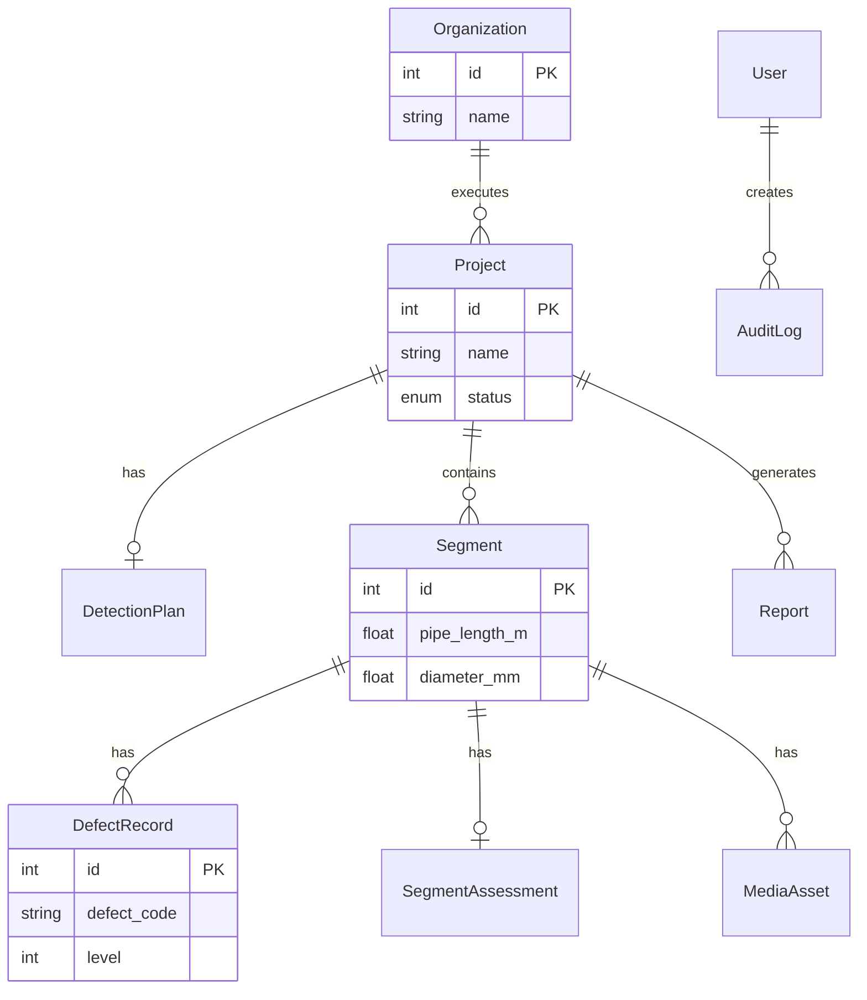
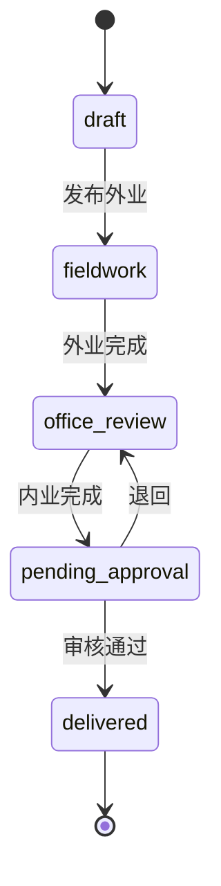

# 领域模型

> 首期 **CCTV 管道检测项目管理** 实体、关系与状态机。字段与 DB31/T 444-2022、附录 D、仓库业务模板对齐。

---

## 1. 实体关系（ER 概要）



---

## 2. 实体定义

### 2.1 Organization（检测单位）

| 字段 | 类型 | 说明 |
|------|------|------|
| `id` | PK | |
| `name` | string | 单位名称（11.3） |
| `legal_person` | string | 法定代表人 |
| `address` | string | |
| `contact_phone` | string | |
| `equipment_list` | JSON | 设备台账（型号、校准日期） |

### 2.2 Project（工程 / 委托）

| 字段 | 类型 | 说明 |
|------|------|------|
| `id` | PK | |
| `name` | string | 项目名称 |
| `project_code` | string | 工程/委托编号 |
| `report_no` | string | 报告编号（如 CC01-2） |
| `client_org` | string | 委托单位 |
| `build_org`, `supervision_org`, `design_org`, `construction_org` | string | 参建单位 |
| `inspection_org` | string | 检测单位 |
| `site_address` | string | 工程地点 |
| `road_name` | string | 路名/工区 |
| `scope_text` | text | 检测范围与内容 |
| `site_manager` | string | 现场负责人 |
| `contact_name`, `contact_phone` | string | |
| `field_start_date`, `field_end_date` | date | 外业工期 |
| `status` | enum | 见 §3 |
| `k_value_default` | int | 工程默认 K（可路段覆盖） |
| `rules_version` | string | 评估规则包版本 |
| `created_at`, `updated_at` | datetime | |

### 2.3 DetectionPlan（检测方案）

| 字段 | 类型 | 说明 |
|------|------|------|
| `project_id` | FK | |
| `purpose` | text | 5.3a 目的任务范围 |
| `existing_data_analysis` | text | 5.3b |
| `technical_method` | text | 5.3c CCTV 方法 |
| `plugging_cleaning` | text | 5.3d |
| `drainage_plan` | text | 5.3e |
| `traffic_plan` | text | 5.3f |
| `qa_measures` | text | 5.3g |
| `issues_countermeasures` | text | 5.3h |
| `workload_schedule` | text | 5.3i–j |
| `staff_equipment` | text | 5.3j–k |
| `deliverables` | text | 5.3k 成果清单 |
| `version` | int | 方案修订号 |

### 2.4 Segment（管段）

| 字段 | 类型 | 说明 |
|------|------|------|
| `id` | PK | |
| `project_id` | FK | |
| `segment_uid` | string | `{project_code}_{start}-{end}_{hash8}` |
| `segment_code` | string | 管段编号 |
| `chain_start_label`, `chain_end_label` | string | 起终点井号 |
| `pipe_system` | enum | 雨水/污水/合流 |
| `pipe_material` | string | |
| `diameter_mm` | float | 等效管径 |
| `pipe_length_m` | float | L，评估分母 |
| `inspected_length_m` | float | 检测长度 |
| `burial_depth_m` | float | 埋深 |
| `inspection_direction` | enum | upstream_downstream / downstream_upstream |
| `road_segment` | string | 路名路段 |
| `k_value`, `e_value`, `t_value` | int | 可覆盖工程默认；E/T 可自动由管径/土质推导 |
| `soil_type` | enum | general / silty_sand |
| `assessment_complete` | bool | ZZ/RS 等导致不完整时 false |
| `video_disc_no` | string | |
| `original_video_path` | string | 规范化前路径 |
| `video_relpath` | string | 存储相对路径 |
| `preview_frame_relpath` | string | |
| `created_at` | datetime | |

### 2.5 DefectRecord（缺陷 / 附录 D 行）

| 字段 | 类型 | 说明 |
|------|------|------|
| `id` | PK | |
| `segment_id` | FK | |
| `distance_m` | float | |
| `video_index`, `photo_id` | string | |
| `defect_code` | string | PL, CJ, KS01, … |
| `kind` | enum | structural / functional / special / operation |
| `level` | int | 等级或 WS 百分比编码 |
| `longitudinal_length_m` | float | 纵向长度，默认 1 |
| `clock_position` | string | 4 位钟点 |
| `note` | text | |
| `video_start_s`, `video_end_s` | float | 媒体片段 |
| `exclude_from_mi` | bool | FZ 为 true |

### 2.6 SegmentAssessment（评估快照）

| 字段 | 类型 | 说明 |
|------|------|------|
| `segment_id` | FK 1:1 | |
| `S`, `F`, `Y`, `G` | float | 中间量 |
| `ri`, `mi` | float | |
| `ri_grade`, `mi_grade` | string | 一级/二级/三级 |
| `ri_advice`, `mi_advice` | text | 表 16/21 文案 |
| `computed_at` | datetime | |
| `rules_version` | string | |

### 2.7 MediaAsset

| 字段 | 类型 | 说明 |
|------|------|------|
| `segment_id` | FK | |
| `type` | enum | video / frame / clip |
| `relpath` | string | |
| `duration_s` | float | |
| `metadata` | JSON | 分辨率、编码等 |

### 2.8 Report

| 字段 | 类型 | 说明 |
|------|------|------|
| `project_id` | FK | |
| `template_id` | string | CC01-2-base |
| `docx_relpath`, `pdf_relpath` | string | |
| `status` | enum | draft / pending_review / approved |
| `approved_by` | FK User | |
| `generated_at` | datetime | |

### 2.9 User / AuditLog（首期简化）

| User | `role`: admin / inspector / reviewer / readonly |
| AuditLog | `entity`, `entity_id`, `action`, `user_id`, `payload`, `at` |

---

## 3. 项目状态机



| 状态 | 说明 |
|------|------|
| `draft` | 委托信息、方案编制 |
| `fieldwork` | 视频挂接、看板 |
| `office_review` | 缺陷录入、评估 |
| `pending_approval` | 报告生成待审 |
| `delivered` | 成果包已交付 |

---

## 4. 管段 UID 规则

```text
segment_uid = lower(project_code) + "_" + sanitize(start) + "-" + sanitize(end) + "_" + hash8
```

- `sanitize`：仅保留字母数字与 `-`  
- `hash8`：规范化视频路径或创建时间 SHA256 前 8 位  
- OCR 建议名须 **人工确认** 后写入 `segment_uid` 与 `video_relpath`

---

## 5. 与规程对照索引

| 实体 | 规程 |
|------|------|
| DetectionPlan | 第 5.3 节 |
| Segment 表头 | 附录 D、7.2.3 |
| DefectRecord | 附录 D 表体、表 7–11 |
| SegmentAssessment | 第 10.3–10.4 |
| Report | 第 11.5、附录 K/L |

---

## 相关文档

- [evaluation-engine.md](evaluation-engine.md)  
- [forms-appendix-d.md](forms-appendix-d.md)  
- [../templates/report-mapping.md](../templates/report-mapping.md)
