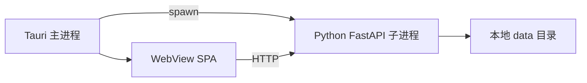

# 桌面 GUI 规格

> 与 Web **共享同一后端 API 与业务模型**；桌面端解决大文件、本地路径、离线单机与一键启动。

---

## 1. 方案选型

| 方案 | 说明 | 推荐 |
|------|------|------|
| **A. Tauri 2 + WebView** | 壳内加载与 Web 相同 SPA；Rust 侧启动 Python 子进程 | **首期推荐** |
| B. PySide6 / Qt | 原生控件；离线无 Node；开发与 Web 双轨成本高 | 强离线备选 |

本文按 **方案 A** 描述；选 B 时仅替换壳层，API 与数据层不变。

---

## 2. 架构

| 职责 | 承担方 |
|------|--------|
| 窗口、托盘、单实例 | Tauri |
| 业务 UI | React SPA（与 Web 同构建产物） |
| API、评估、报告 | FastAPI sidecar |
| 视频/报告文件 | 用户可选 `data_root` |

---

## 3. 桌面增强功能

| 功能 | 说明 |
|------|------|
| 数据目录选择 | 首次启动选择 `data_root`；写入 `%AppData%/CCTV-PM/config.json` |
| 本地路径挂接 | 对话框选 `.mp4` → `POST /segments/{id}/video` `{ "local_path" }`；后端 copy 或 symlink |
| 文件夹监视 | 监视 `视频/inbox` 自动创建管段草稿（可选） |
| 依赖自检 | 启动时检测 `ffmpeg`、`ffprobe`、`soffice`；缺失时向导下载说明 |
| 后端生命周期 | 退出应用时终止 uvicorn；异常崩溃提示日志路径 |
| 单用户模式 | 默认跳过 JWT；设置中可启用本地 PIN |
| 自动更新 | 二期：Tauri updater |

---

## 4. 与 Web 差异

| 维度 | Web | 桌面 |
|------|-----|------|
| 部署 | 浏览器访问服务器 | 安装包 |
| 视频上传 | HTTP multipart，受大小限制 | 本地路径为主 |
| 认证 | JWT 多用户 | 可选免登录 |
| 打印 | 浏览器打印 | 调用系统默认打印机（二期） |
| 离线 | 需网络 | 完全本地 |

**UI 代码**：`frontend/` 单仓；`import.meta.env.TAURI` 分支隐藏「服务器地址」等桌面不需要项。

---

## 5. 启动流程

1. Tauri 启动 → 读取 `data_root`  
2. 若 sidecar 未运行 → `spawn(python -m uvicorn app.main:app --port 0)` 动态端口写入环境  
3. WebView 加载 `http://127.0.0.1:{port}`  
4. 健康检查 `/health` 通过后显示 UI  

开发：`npm run tauri:dev` 并行启动 bootstrap 脚本等待 API。

---

## 6. 打包与分发

| 平台 | 产物 |
|------|------|
| Windows | `.msi` / NSIS；捆绑 Python 嵌入式运行时或 PyInstaller sidecar |
| macOS | `.dmg`（二期） |

安装包体积控制：OCR 模型、Paddle 可选「首次运行下载」。

---

## 7. 安全

- 本地 API 仅绑定 `127.0.0.1`  
- 路径挂接须通过 `path_policy` 校验，禁止 `..` 逃出 `data_root`  

---

## 相关文档

- [web-ia.md](web-ia.md)  
- [../CCTV-PM-SDD.md](../CCTV-PM-SDD.md) §6、§12
